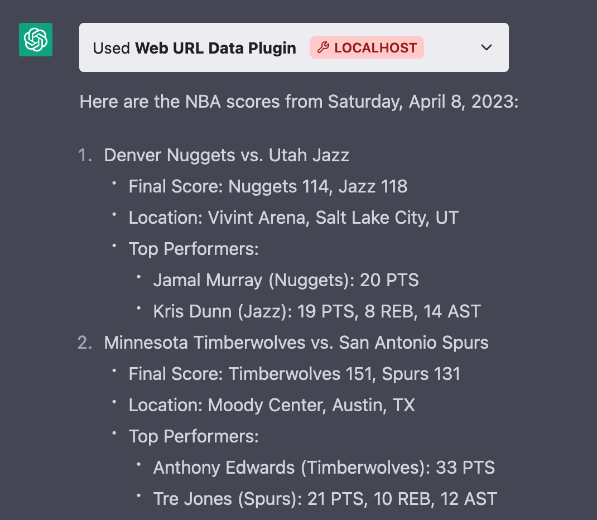

# gptplugindemo

Simple demo for Openai ChatGPT plugin using locally running fastapi backend.

## Ask ChatGPT to generate necessary files for you

In order to register your plugin you have to provide 2 files. We can ask ChatGPT to generate it for us.

I recommend providing examples from [https://github.com/openai/chatgpt-retrieval-plugin/](https://github.com/openai/chatgpt-retrieval-plugin/blob/main/local-server/openapi.yaml) to ensure quality of ChatGPT's answer.

Queries I used:

```
Please generate openapi.yaml file for my API endpoint based on provided code and example from another API.
be as descriptive and detailed as possible and adjust file based on my API

this is my code in fastapi:
<my code from main.py>

HERE is example of another API:
<example from OpenAI's github>
```

```
OK thanks.
Now using provided documentation and example of different API, please generate ai-plugin.json file for my API.
Review documentation and example so you can understand expected structure and generate new file based on my API's code I provided in previous step. Be very detailed in your description, especially focusing on description_for_model section.

Here goes documentation:
<HERE I pasted docs for Plugin manifest from OpenAI page>

And HERE goes example of another API:
<example from OpenAI's github>
```

## My files

### ai-plugin.json

```json
{
  "schema_version": "v1",
  "name_for_model": "web_url_data",
  "name_for_human": "Web URL Data Plugin",
  "description_for_model": "Plugin for extracting text data from a given web URL. Use it to retrieve textual content from any web page for analysis or processing. Just provide the URL of the web page and get the extracted text data.",
  "description_for_human": "Extract text data from a web URL.",
  "auth": {
    "type": "none"
  },
  "api": {
    "type": "openapi",
    "url": "http://localhost:8000/.well-known/openapi.yaml",
    "is_user_authenticated": false
  },
  "logo_url": "http://localhost:8000/.well-known/logo.png",
  "contact_email": "support@yourdomain.com",
  "legal_info_url": "http://www.yourdomain.com/legal"
}
```

### openapi.yaml

```yaml
openapi: 3.0.2
info:
  title: Web URL Data API
  description: A FastAPI to extract text data from a given web URL
  version: 1.0.0
servers:
  - url: http://localhost:8000
paths:
  /get_data_from_url:
    post:
      summary: Get Data from URL
      operationId: get_data_from_url
      description: Accepts a URL and returns the extracted text data from the web page
      requestBody:
        content:
          application/json:
            schema:
              $ref: "#/components/schemas/ProcessWebUrl"
        required: true
      responses:
        "200":
          description: Successful Response
          content:
            application/json:
              schema:
                $ref: "#/components/schemas/URLResponse"
        "400":
          description: Bad Request
          content:
            application/json:
              schema:
                $ref: "#/components/schemas/Error"
components:
  schemas:
    ProcessWebUrl:
      title: ProcessWebUrl
      type: object
      properties:
        url:
          title: URL
          type: string
          format: uri
          example: "https://example.com"
      required:
        - url
    URLResponse:
      title: URLResponse
      type: object
      properties:
        data:
          title: Data
          type: string
          description: Extracted text data from the provided URL
    Error:
      title: Error
      type: object
      properties:
        code:
          title: Error Code
          type: integer
        success:
          title: Success
          type: boolean
        message:
          title: Error Message
          type: string
```

## Install and run it!

Now having all files you can start your API!

### Local install

```bash
pip install -r requirements.txt
uvicorn main:app --host 0.0.0.0 --port 8000 --reload --log-level debug --reload-dir .
```

### Local docker

```bash
docker build -t gptdemo .
docker run -dp 8000:8000 gptdemo
```

## Test it!

Check in your browser:

[http://localhost:8000/docs](http://localhost:8000/docs)

## Register your plugin

As of today (9/April/2023) you have to go through waitlist to use plugins.

Go to Plugin store -> Develop your own plugin and provide:

```
localhost:8000
```

And that should be it.

Enable your new plugin and test it.

## Example

Example query

```
can you check yesterday's NBA scores?
```

Example answer:



## Docs

[ChatGPT plugins docs](https://platform.openai.com/docs/plugins/introduction)

[plugin-manifest](https://platform.openai.com/docs/plugins/getting-started/plugin-manifest):

[openapi-definition](https://platform.openai.com/docs/plugins/getting-started/openapi-definition)